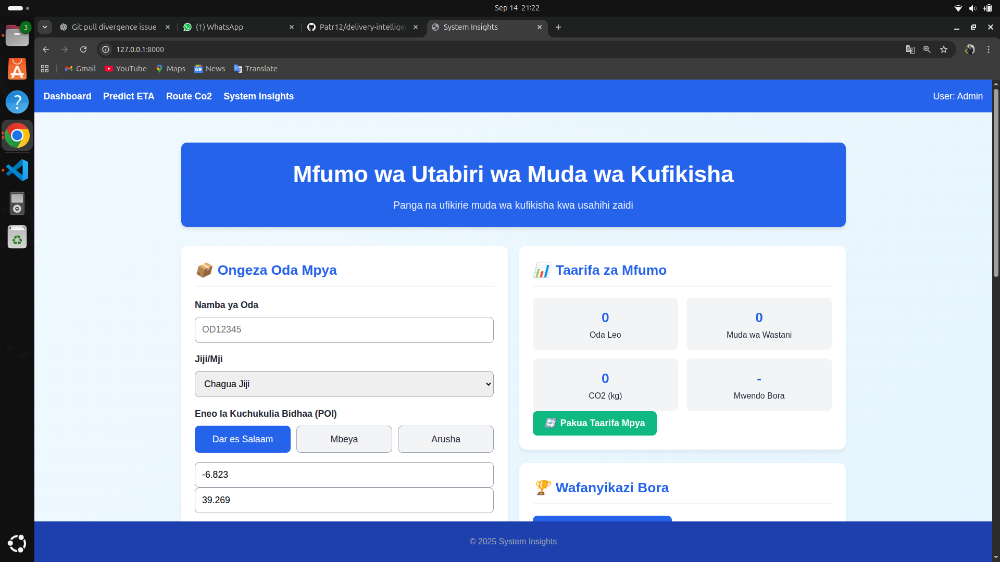
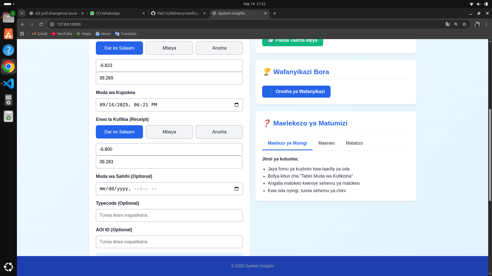
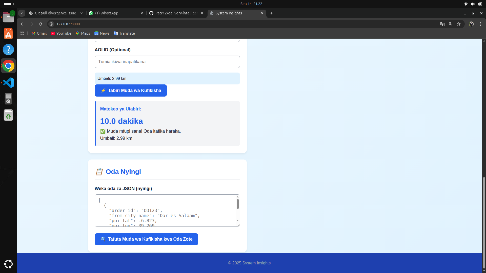
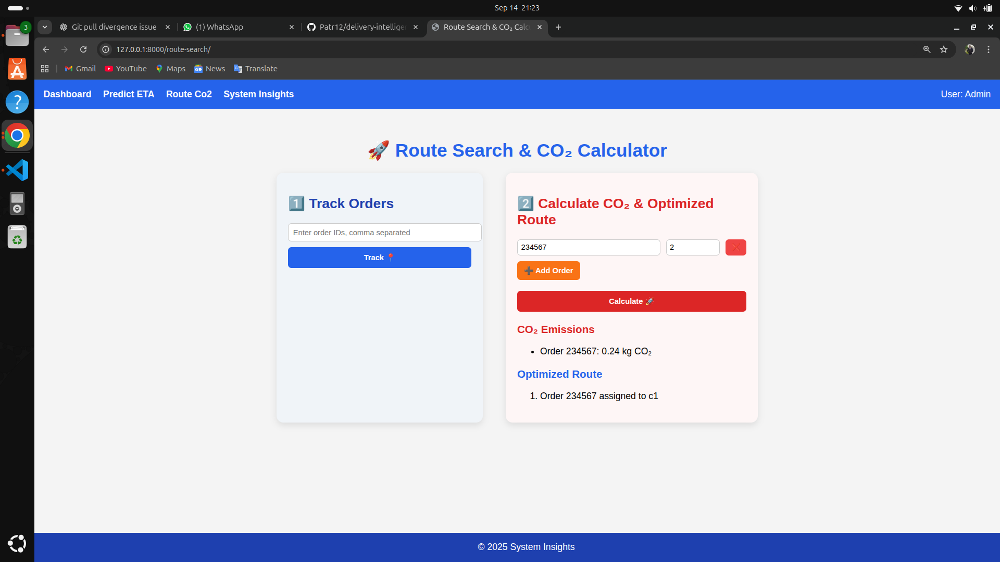
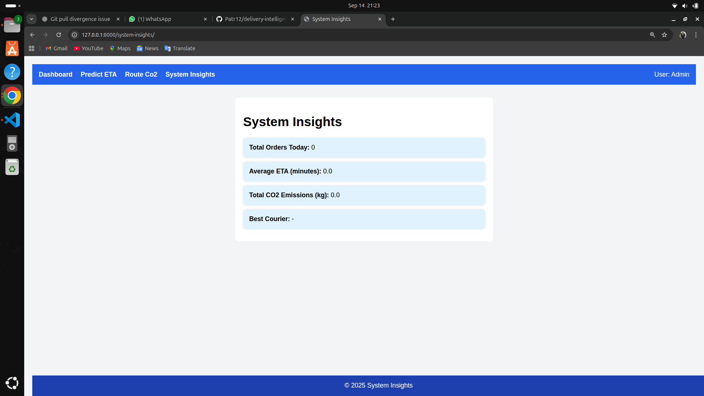

# Delivery Intelligence System — Hackathon Starter
# (a) Team member
Mgala Salavatory Patrice ID DCM/25/02246
ELISHA SADALLAH          ID DCM/24/01740

## (b) Problem
The postal and courier sub-sector in Tanzania faces major challenges in **delivery delays, lack of transparency, fraud detection, and operational inefficiencies**.  
The dataset provided (`courier_dataset.csv`) contains ~470,000 records across five major cities, including order details, courier information, geo-location data, and timestamps.  
The problem is to use **AI/ML** to:  
1. Predict parcel delivery completion times (ETA).  
2. Detect anomalies in delivery patterns (suspiciously long/short times).  
3. Provide insights and dashboards to support decision-making.  

---

## (c) Solution Overview
Our solution is an **AI-powered Delivery Intelligence System** that integrates prediction, anomaly detection, and visualization:  

- A **Machine Learning model** (LightGBM) trained on cleaned and feature-engineered data to **predict Estimated Delivery Time (ETA)**.  
- **Anomaly Detection** using a hybrid approach (rule-based + Isolation Forest) to flag suspicious deliveries that may indicate fraud or operational issues.  
- An **interactive dashboard** (Streamlit) to visualize predicted vs actual delivery times, courier performance, city-level insights, and anomaly alerts.  
- A **RestAPI ** exposing `/predict_eta` and `/detect_anomaly` endpoints for integration with external systems.  

This system helps courier operators improve efficiency, reduce fraud, and make better operational decisions.  

---

## (d) Instructions to Run the Project

### 1. Clone Repository
```bash
git clone https://github.com/Patr12/delivery-intelligence-system.git
cd delivery-intelligence-system
for applictation git hub link ssh 
https://github.com/Patr12/delivaX.git

This starter kit helps you build an **AI-powered Delivery Intelligence** solution on top of `courier_dataset.csv` (~470k
`REMEMBER IMPOTANTANT NOTE` * ***  kumbuka kuweka data set zote because file ni kubwa sana nime weka chache repositore ina shidwa kubeba zaidi ya GB1 KUENDELEA *** rows across five cities). It includes:
- ETA prediction (regression) + **SLA risk scoring**
- **Courier assignment** (greedy cost-based) with plug-in for route optimization
- **Anomaly detection** (simple rules + isolation forest toggle)
- **City/zone heatmaps** + ops analytics (in python editor)
- A small **REST-API** app exposing `/predict_eta`, `/assign_courier`, `/anomaly_check`, `/metrics/coverage`

> Place `courier_dataset.csv` at the project root or update the path in code.

## Quickstart
```bash
python -m venv env
# Activate on Windows
env\Scripts\activate
# Activate on Linux/Mac
source env/bin/activate

# 1) Create env (recommended) and install deps
pip install -r requirements.txt

# 2) Ku train model 

python train_model.py
# 2) Explore data + train a baseline model
# jupyter notebook notebooks/starter_notebook.ipynb

# 3) Run API (after training writes model.pkl + feature_columns.json)
# uvicorn app.main:app --reload --port 8000
python manage.py runserver 0.0.0.0:8000
```

## Expected Columns (clean names)
We normalize column names and handle common typos:
- `order_id`
- `from_city_name`
- `delivery_user_id`
- `poi_lng`, `poi_lat` (pickup coords) — often appears as `poi_Ing` ➜ fixed
- `receipt_time` (string/datetime) — often appears as `receipt time` ➜ fixed
- `receipt_lng`, `receipt_lat` (drop-off coords)
- `sign_time` (string/datetime)

## Key Targets & Features
- **delivery_duration_min** = (sign_time - receipt_time) in minutes
- **haversine_km** between pickup & drop-off
- **bearing_deg**, **hour_of_day**, **dow**, **is_weekend**, **city** (one-hot), **courier_history** features

## Roadmap Ideas
- Add graph routing (OSMNX) for realistic network distance/speed
- Learn-to-rank for courier assignment (pairwise ranking model)
- Real-time incident features (weather/events) if available







